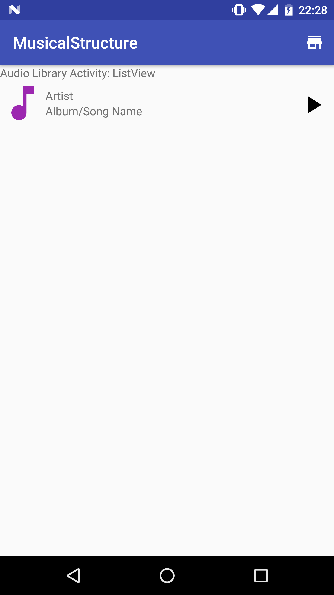
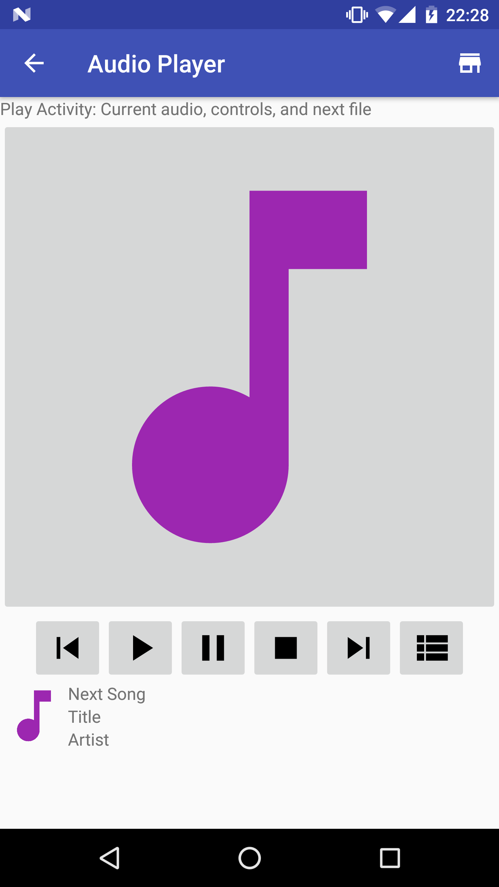
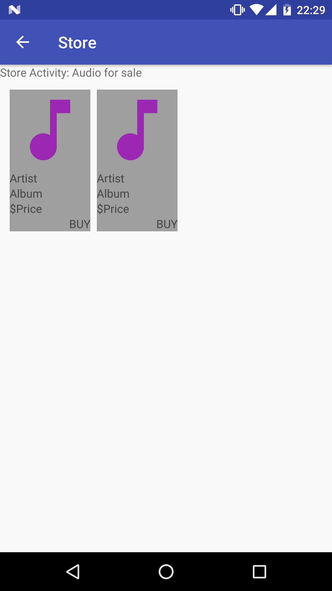

# Android Musical Structure App
- Project **Musical Structure** of Android Basics Nanodegree
- [Android Basics Nanodegree at Udacity.com](https://www.udacity.com/course/android-basics-nanodegree-by-google--nd803).

## Android Items
- Intents
- Activities
- Payment API

## Description 
- Structure of a music player app

## Screenshots
 

 